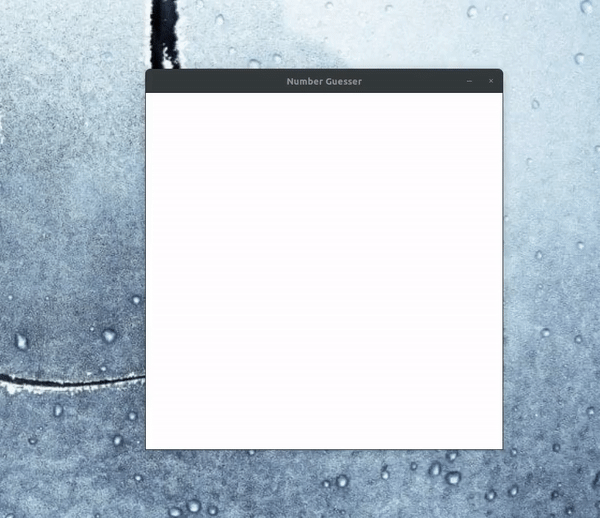

# Guessing the numbers using AI

This project was based on the https://www.youtube.com/channel/UC4JX40jDee_tINbkjycV4Sg video were he used a pygame interface to draw a number and predicting the number using the mnist dataset to train. 

I trained his DNN model and made a CNN version. 
This is the current version. 

I follow the training using tensorboard. Check below the results. 

